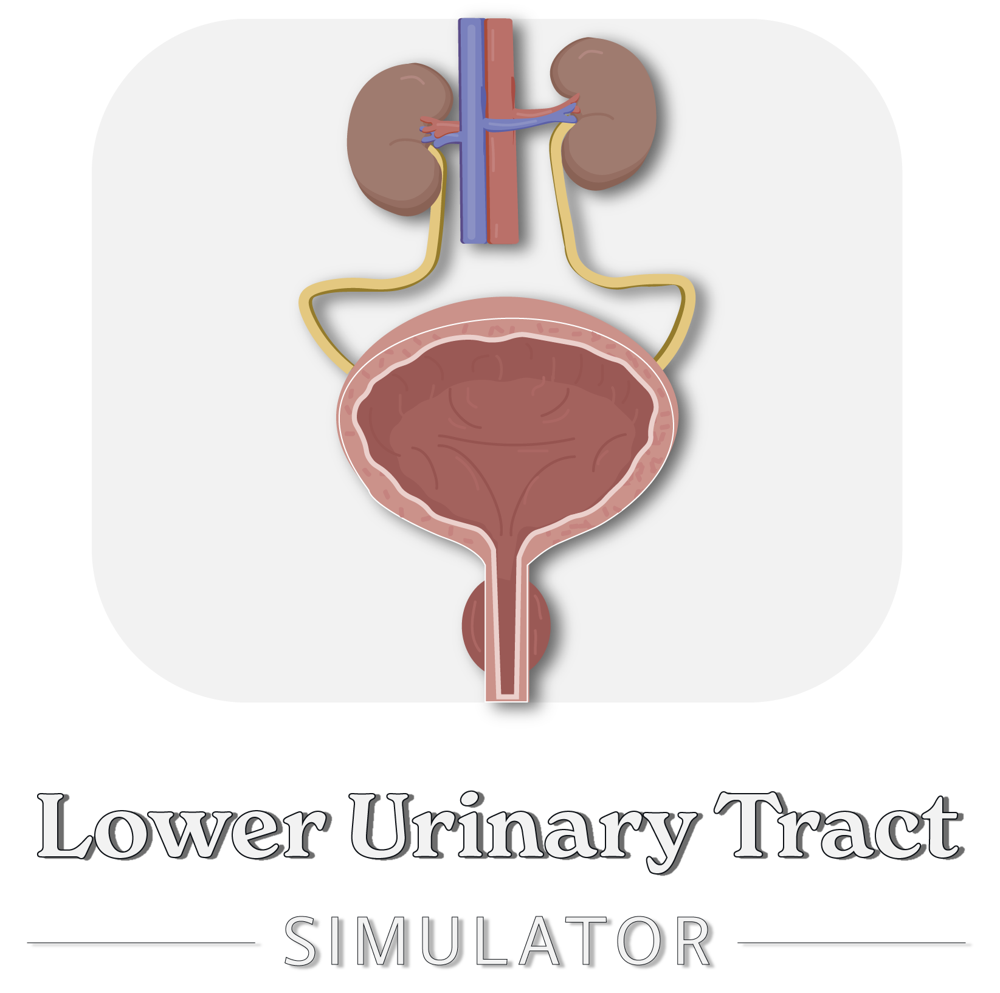

## Overview
This repository contains a Python-based model that simulates the dynamics of the bladder, sphincter, and kidney, using normalised neural signals to predict pressure and volume of the bladder.

For more detailed mathematical explanations, please refer to the paper: [An Open-Source Neurodynamic Model of the Bladder](https://doi.org/10.1101/2024.11.21.624716). DOI: [10.1101/2024.11.21.624716](https://doi.org/10.1101/2024.11.21.624716)

## Key Features
- **Stochastic Kidney Function**: Reflects natural fluctuations in urine production throughout the day, incorporating randomness to account for biological variability.
- **Neural Input Modeling**: : Features a built-in parameter-based model to simulate neural signals from the brain. This allows for simple modeling of neurological conditions and their effects on the lower urinary tract, as well as the use of external neural models to stimulate the detrusor and sphincter muscles.

## Repository Structure
*   `model`: Contains the Python code for the LUT model (`LUT_model.py`).
*   `paper_figures`: Contains a Jupyter notebook (`figures.ipynb`) that reproduces the figures presented in the paper and the experimental data used for validation (`RealBladderData.mat`). This folder also contains two modified versions of the LUT model (`LUT_Model_OAB.py` and `LUT_Model_BOO.py`) alongside a Jupyter notebook (`hypotheses.ipynb`) to reproduce pathological hypotheses presented in the paper.

## Installation
Clone the repository and install the required dependencies:

```bash
git clone https://github.com/MoveR-Digital-Health-and-Care-Hub/lower-urinary-tract-sim.git
cd lower-urinary-tract-sim
pip install -r requirements.txt
```

## Use
```python
from model import LUT_Model as model

dT = 0.1 # Time Step
maxTime = 300 # Seconds

# Create a lower urinary tract instance
LUT = model.LUT()

# Run the simulation
data = LUT.process_neural_input(maxTime, dT)
```

### Optional Runtime Parameters
- `noise` (default = 1): Controls the level of noise in the kidney output/bladder inflow.

- `V_unit` (default = 'm^3', supports: 'm^3', 'ml'): Unit for volume measurements.

- `p_unit` (default = 'Pa', supports: 'Pa', 'cmH2O'): Unit for pressure measurements.

- `verbose` (default = False): When enabled (set to True), provides simple progress updates (e.g., 'Progress: X%'), which can be useful for monitoring the completion status of long-running simulations.

- `seed` (default = None): When provided a numerical seed (e.g. 42), the random noise will be reproducible between LUT model instances.

- `trigger_metric` (default = 'pressure', supports: 'pressure', 'volume'): Used to determine which metric triggers voiding, based on their respective thresholds.

### Example Output of `data`

| $V_B$          | $f_{aD}^*$    | $f_{aS}^*$  | $r_U$ | $Q$  | $p_D$ | $p_S$ | $Q_{in}$ | $t$       | $\omega_e^*$  | $\omega_i^*$ | $\omega_s^*$ | voiding |
|--------------|-----------|---------|-----|----|-----------|------------|--------------|---------|--------|-------|-------|---------|
| 5.012659e-09 | 0.004000 | 0.25000 | 0.0 | 0.0 | 17.459235 | 2947.032009 | 5.012659e-08 | 0.0     | 0.040000 | 0.1   | 0.5   | False   |
| 1.002532e-08 | 0.007560 | 0.37500 | 0.0 | 0.0 | 33.032752 | 4370.548014 | 5.012657e-08 | 0.1     | 0.040002 | 0.1   | 0.5   | False   |
| 1.503797e-08 | 0.010729 | 0.43750 | 0.0 | 0.0 | 46.926197 | 5082.306016 | 5.012655e-08 | 0.2     | 0.040003 | 0.1   | 0.5   | False   |
| 2.005062e-08 | 0.013549 | 0.46875 | 0.0 | 0.0 | 59.322788 | 5438.185017 | 5.012653e-08 | 0.3     | 0.040005 | 0.1   | 0.5   | False   |
| ...       | ...     | ... | ... | ...       | ...        | ...          | ...     | ...    | ...   | ...   | ...     |
|||||||||||||

